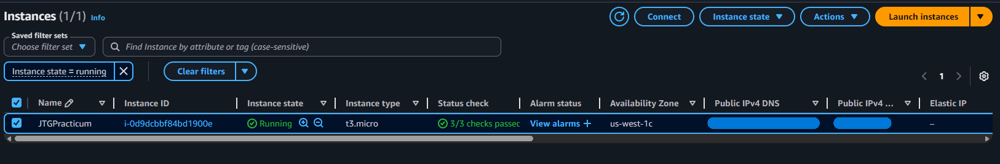
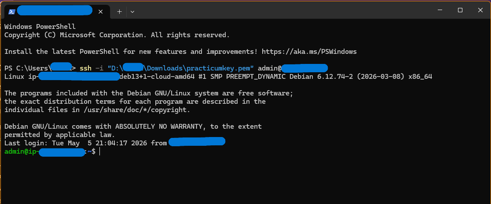

# Cloud_Server_Setup_AWS
Cloud server setup and security configuration for a free tier AWS Debian VM

# AWS EC2 Instance Setup

Documentation for the virtual machine setup on AWS.

## Instance Overview

## Security Configuration
* **Inbound Rules:** Restricted to SSH (Port 22) from my local IP.

## Connection Verification
Successfully connected via SSH using Windows Terminal.

